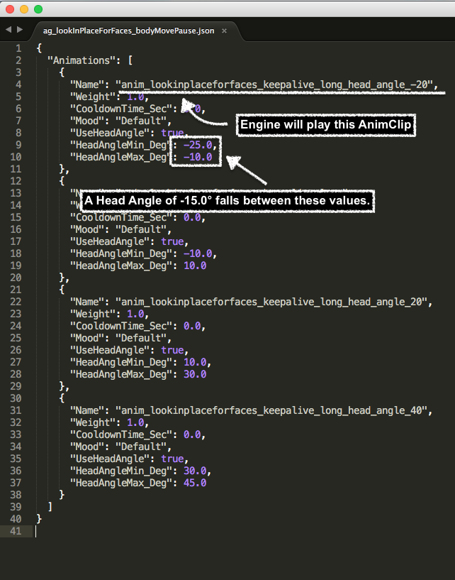

# Animation Parameters

## UNITS STANDARDS
### Time Units
*Frames per second* (fps) and *milliseconds* (ms) are the 2 main time units used in the animation pipeline. The animations are converted to play at 33 fps – the frame rate the animation stream is operating at. Using a different frame rate will most likely make the animation streamer drop frames.

### Geometric Units
* *Millimeters* (mm) and *degrees* (°) are the main geometric units used in the animation pipeline.

* Lift keyframes use lift height (mm).
* *Millimeter/Second* (m/s) is the standard speed unit.

## OPTIMAL STANDARDS
### Head Angles
#### Detecting Cubes
The generally accepted optimal head angle for detecting cubes on the 0 ground plane is -17°. This value is currently based on observation and subject to change.

### Lift Height
It is generally advisable not to move the lift to it's max height, in animation and in general. At max height the gears get sticky many time and the lift may have an undesired "pop" on the way down.

## AnimGroup Parameters

Weight
: Float. This value defines the play probability ratio for each AnimClip. If each AnimClip within an AnimGroup has the same value of 1.0, there's an equal probability that any of the AnimClips may play when the AnimGroup is called.

CooldownTIme_Sec
: Float. Defines the period of time to wait before playing the specified AnimClip after it was playing once. This parameter is meant to avoid a situation where the same AnimClip plays twice in a row an look repetitive or robotic.

Mood
: String. This parameter is tied to the mood manager which we're rarely using at the moment. It suppose to define which AnimClip should play in a specific state based on the mood state of the robot. If the robot is in a "Happy" state, the engine would only play AnimClips with a "Mood" parameter set to "Happy", and avoid playing AnimClips with a "Mood" parameter set to "Sad".

UseHeadAngle
: Boolean. Defines whether to use the head angle functionality or not. See Head Angles for more details.

HeadAngleMin_Deg
: Float. Defines the minimum head angle the AnimClip should be playing at.

HeadAngleMax_Deg
: Float. Defines the maximum head angle the AnimClips should be playing at.

### Audio Frame parameters

Wwise ID Enum
: We name our audio events using a very particular naming convention that is then used to sort our events by Wwise ID Enum. Looking at the event above *Play__Robot_Vic_Sfx__Lift_High_Down_Long_Sad* the enum would be *Robot_Vic_Sfx*. Changing the ID Enum is a quick way to toggle between different sets of audio events used across the robot.  This is converted from the full audio event name.

Probability:
: This value controls the overall likelihood that an audio keyframe will be played when being called upon. 100% will result in a successful playback every time the keyframe is called, with lesser values resulting in few successful plays.

Volume
: This controls the overall volume that a keyframe will be played coming off the robot. This is independent of Wwise volumes but works additively with Wwise's gain structure.

### Head Angles

#### What are head angles?

The Head Angles system is basically an AnimClip chooser. It chooses what AnimClip to play based on a certain angle range the robot's head has to be in in order for the animation to play correctly. For example, if the robot has to look at the user's face, the engine calculates at what angle the robot has to raise or lower his head to, to covey that he is looking at the user. Based on that value and the HeadAngle min/max values on each AnimClip, the engine will choose the AnimClip designed to play at the correct angle.

#### How do head angles work?

Any time an AnimGroup is played and the "UseHeadAngle" parameter is set to TRUE, the engine will look at the current head angle value of the robot. Based on the returned value, the engine will play the AnimClip with the corresponding min/max HeadAngle values.

For example, the AnimGroup `ag_lookInPlaceForFaces_bodyMovePause.json` has the "UseHeadAngle" parameter set to TRUE. If `ag_lookInPlaceForFaces_bodyMovePause.json` is called and the head angle on the robot is set to be -15.0, that means that the AnimClip "anim_lookinplaceforfaces_keepalive_long_head_angle_-20" will be played since -15.0 falls between -25.0 and -10.0.

_Pros and Cons of head angles_
 

## ANIMATION ASSETS

### AnimationGroups
Details on AnimGroups and the JSON files.

### Animations
Details on TAR files and the JSON files, including the different tracks:

* BodyMotionKeyFrame
* LiftHeightKeyFrame
* HeadAngleKeyFrame
* ProceduralFaceKeyFrame
* FaceAnimationKeyFrame
* RobotAudioKeyFrame
* BackpackLightsKeyFrame
* EventKeyFrame

### FaceAnimations

Details on image sequences and the TAR files.

## EVENT TRIGGERS

* How event triggers work 

## IMAGE SEQUENCES

* What are image sequences for
* How image sequences work 