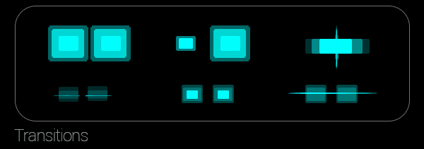
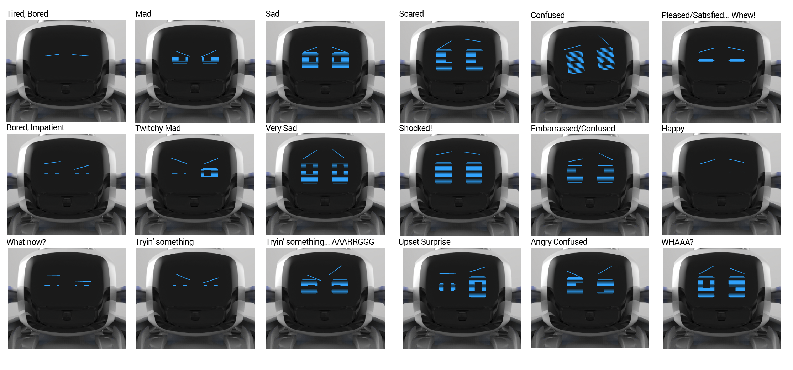

# Animations

Created by Andrew Stein

An *Animation* should be considered a short, largely open-loop sequence of actions used to demonstrate an emotion or reaction. For more complex sequencing and composition, see also Actions.

An animation consists of a set of *Tracks*, each comprised by a set of KeyFrames. Each track controls some subsystem of the robot, such as its headl, lift, or face. KeyFrames are defined in Animations are defined in a JSON file. An authoring tool is in the works for creating this JSON file graphically, instead of manually.

## Current Implementation

Right now, the Robot class reads the animation JSON file and stores all animations defined therein in its *CannedAnimationContainer*. These are then sent to the physical robot and played back by sending a PlayAnimation message which references a corresponding ID number. All canned animations are sent to the physical robot as soon as an instance of the Robot class is instantiated, and the file can also be re-read and re-sent (e.g. if changed externally by the authoring tool) via a command.

Each KeyFrame is defined by (and stored in the CannedAnimationContainer as) a message. They are currently all named starting with "AddAnimKeyFrame_".  Each has track-specific information and a time (in milliseconds) to when the position/angle should be reached or the sound/video should start playing.

These are the tracks on the robot:

1. Head
2. Lift
3. Pose (Body)
4. Face
5. Sound
6. Backpack Lights
7. "Special" this was used for triggering another animation

Once the robot reaches the starting configuration (matching the first KeyFrame), the animation begins to play and the player looks ahead to the next KeyFrame and starts the process of updating its corresponding subsystem to reach that KeyFrame. For example, the Head track starts moving the head to reach the angle specified in the next KeyFrame.

There is limited support for "Transitions" in and out of a KeyFrame, for adjusting the fraction of the time between this KeyFrame and the next (or previous) to use for transitioning out of (or into) the current state. 

## Planned Implementation

The Robot class can still read the animations from JSON files describing KeyFrames, but instead of sending and re-storing them on the physical robot, they will be streamed and played live. This is particularly necessary now that the face is a screen for playing video and there will be an onboard speaker for playing audio, since storing either of these in the robot's onboard memory is infeasible.

There will be two sound tracks, one for sound coming from the device and another for sound coming from the robot. In addition, there will be a track for Backpack Lights and a "Face" track for playing video on the robot's OLED face display. The Head. Lift, and Body tracks will likely stay largely the same, and perhaps simplified to remove the "nodding" primitives.

Implementation in progress: COZMO-141

## Animation Style Guide

A majority of gameplay involves timely mechanics (driving/stacking/visuals/etc.), so animations conveying emotions will mainly occur exclusively on face and as SFX, and not effect Cozmo's physical states (direction, speed, lift height, or head tilt). Given that games will be kinetic and noisy endeavors, we should assign a simple, recognizable set of key frames and sounds that convey the most important of Cozmo reactions. Transitions between states could also be similarly cataloged. For instance, eyes bouncing together might be the established transition to all surprised/confused emotions. While the creation of these guidelines might hem some creative panache, it will likely help users come to better identify and understand Cozmo's reactions.

Animation Guidelines would adhere to something like this:

Thus far, explorations have yielded this set of successful transitions from ambient/idle eyes (left to right, clockwise): Enlarged, Enlarged One, Smashed Together, Horiz. Line Malfunction, Shrunken Eyes, Blink. From these transitions we've arrived at a variety of moods/emotions. It would behoove future implementation to arrive at standards for the set of faces below.

### The Many (but not too many) Faces of Cozmo

| Mad | Sad |Afraid|Happy| Surprised  |Tired | Working    |Confused|
|-----|-----|------|-----|------------|------|------------|--------|
|Sorta|Sorta|Sorta |Sorta| Generic    |Sleepy|Easy (cocky)|Generic |
|Very | Very| Very | Very|Disappointed|Bored | Straining  |  Mad   |
| 	  |	 	|      |     | Happy      | 	 |            |Sad   |
| 	  |	 	| 	   |     | Scared     |      |            |Scared|

Establishing eye templates for these 12 emotions may help users identify Cozmo's moods more quickly, especially in a kinetic game-play when eyes may be viewed only intermittently.

Perhaps a focus test of the static targets would be beneficial. Below are some sample emotions created using Hanns' procedural face rig (a slightly more robust slider system is detailed below). The image suggests that the rig is capable of a relatively wide emotive range (esp. considering that context, SFX, and animation go a long way in selling emotions). 

;

Meanwhile, we're utilizing a minimal amount of locomotion and head movements to convey various emotions. I've tried to catalogue what we've tried in the current prototype in the grid below. Also, see link to Locomotion Animation PDF below.  

### Locomotion & Head Movements

|Forward                 | back   | Back+Forth| Spin         | Wiggle |Look Up|Look Down| Other |
|------------------------|--------|-----------|--------------|--------|-------|---------|-------|
|Happy	                 |Startled|	Happy     |	Upset        | Happy  |	Happy | Sad     |Game-specific Movements|
|Incredulous (inspection)|	Sad	  | Upset     |	Gleeful      |Gloating|	Sad   |Embarrassed||
|Curious (inspection)    | Fearful|	Worried   |	Lost/Confused|Confused|Hopeful|||
|                        |        |	Excited   |              |        |       |||

(Locomotion_Animation.pdf)[Locomotion_Animation.pdf]

## Procedural Face Rig

Implementing these sliders into the Animation Tool (not all will be function at the outset)

*Brow*

* Brow Angle L/R - animators would prefer define the rotation point
* Brow Location X/Y
* Brow length

*Eyes*

* Eye Height (L/R)
* Eye Width (L/R)
* Eye Location (L/R) - at least Y axis - this is needed if there's a desire for eyes to be moved independently (askew)
* Pupil Location (X/Y) - This slider needs an on/off toggle to allow pupils to be moved in tandem or independently
* Pupil Size

*Face*

* Up/Down 
* Angle - degree to be set to avoid any bleeding of face features
