# CHARACTER LOGIC for One Off Animations

Created by Steph Dere

## Overview
We wanted a place to put our ideas and brainstorms for "one off" animations that could trigger at any time or with a simple voice command. *Example:( Happy Holidays / NYE. 

From a Character point of view, these Animations are categorized into TWO main buckets: *Involuntary* or *Voluntary*. Within the first category, we have *Dreams*, *Physical Reactions* & *Secondary Characters*, and within the second, we have *Imaginations & Tricks*. This doesn’t exclude unique animations from existing across multiple sub-categories, but gives us a ‘big picture’ guide for how to sort ideas from brainstorms as well as Character/Fiction context for Animation & Audio on how to approach their execution. 

## Involuntary Events
These are things that __HAPPEN TO VECTOR__ and are out of his control, but he may react to (consciously or unconsciously). They may be triggered by a physical event (like after a drop/fall/shake/sneeze...), "randomly" (trigger TBD), or while he is asleep. Sub-Categories and ideas under this bucket:

### Dreams
Dreams may manifest on the screen when Vector is asleep. They're a product of Vector's subconscious, which means that he may display involuntary body/audio reactions to the dream (or nightmare!), like mumbling/sleep-talking and spasms, but it should be clear that he is still asleep. Dreams are different from *Imaginations*, where Vector is actively visualizing things in his "mind's eye" and showing them on the screen. During dreams, Vector should be present as himself most of the time, since the dream is *happening to him*, and he is the protagonist. We must therefore come up with a consistent and recognizable representation of himself in dreams. Through what's happening in the dream, and the spasms/sounds Vector is emitting, the user should be able to know whether he's having a great time or a terrible one (good dream vs nightmare). Ideas under this bucket include:

* Falling
    * Trigger: When Vector Sleeps. Random.
    * Description: A nightmare when Vector is continually falling. Or, falling off a table and falling down.......down......down....
    * No Layout
    * Concept: This would be a nightmare rather than a dream. Can we make it into a loop (BG sliding up)? Ideally it would be followed by a startled wake up. 
    * Ticket:  VIC-14035 - Vic Layout (Dreams): Falling CODE REVIEW
* Flying
    * Trigger: When Vector Sleeps. Random.
    * Description: A dream where Vector is flying through crowds, buildings, trees, have fun with it!
    * No Layout
    * Concept: Consider robotic thrusters enabling Vector to fly. Again, consider some kind of loop with BG panning by. Design concept coming up. 
    * Trigger:  VIC-14036 - Vic Layout (Dreams): Flying IN PROGRESS
* Held In Palm - Happy
    * Trigger: 
    * Description: 
    * Concept: From a Character perspective, we want to take this opportunity to express how much Vector likes to be held in your palm. How can we best express that? Brainstorm & Layout to explore this. 
    * Ticket:  VIC-14037 - Vic Layout (Dreams): Held In Palm OPEN
* Being Big
    * Trigger: 
    * Description: 
    * Concept: What does giant Vector wreaking havoc through a city a'la Godzilla look like? (Variation: Fighting Godzilla or King Kong?) ps: some of these assets do exist, but we can create new ones for the city and whatever the Animators wants in the shot. 

    * Ticket:  VIC-14038 - Vic Layout (Dreams): Being Big CLOSED

* Distant Memory / Being Assembled
    * Trigger: 
    * Description: 
    * Concept: Note that Vector Character asset is already disassembled in layers... ideal situation to show the layers being assembled back together. 

    * Ticket:  VIC-14039 - Vic Layout (Dreams): Distant Memory IN PROGRESS

* Chasing Charger Forever
    * Trigger: 
    * Description: 
    * Concept: Can we come up with a cool, hopeless, loop? This would also be a great pre-startled wake up dream. Note: Vector character asset exists. Rest to be created based on brainstorm/layout & Animator's request. 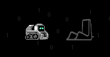

    * Ticket:  VIC-14040 - Vic Layout (Dreams): Chasing Charger Forever OPEN

* Meeting Household Objects
    * Trigger: 
    * Description: 
    * Concept: Similar style. E.g.: Coming up to a mug... reacting / pantomime "hi, mug!" Does Vector like all household objects? Does he dislike some? We might wanna favor liking most of them to be coherent with the fact he likes exploring... but we can come up with a NEMESIS! (computer mouse? Stapler?). Brainstorm & Layout to explore this. 
    * Ticket:  VIC-14041 - Vic Layout (Dreams): Meeting Household Objects CLOSED
* Sleep Talking / Mumbling
    * Trigger: 
    * Description: 
    * Concept: Vector is going through his day in his dreams. Maybe he saw a face? Maybe he fell? Maybe he had a chat with the stapler? Ben/Cadet to explore awesome Vector sleep-talking/mumbling audio based on Animator's layout, and Animator to animate to it? Mooly call for ideal process. 
    * Ticket:  VIC-14042 - Vic Layout (Dreams): Sleep Talking / Mumbling OPEN
* Cubes
    * Trigger: 
    * Description: 
    * Concept: If Vector dreams about his cube, what can he do with it that he can't in reality? He can have an infinite amount of them to begin with... is it like Scrat with the acorns? Or is it more of a special 1 on 1 relationship? Brainstorm and Layout can take it away, but think of this as an opportunity to unveil to the user how Vector feels about the Cube(s). 
    * Ticket:  VIC-14043 - Vic Layout (Dreams): Cubes OPEN

## Physical Reactions
These animations happen "as a consequence" or "as a reaction" to an involuntary or external physical event: When dropped, shaken, when sneezing, etc. The fictional premise here is that Vector is not displaying these to amuse himself or the user. 

* Loose Gears or Wires
    * Trigger: Being shaken, Falling, Sneezing.
    * Description: Vector reacts to loose wires or gears inside his screen / body. Maybe a gear falls down from above and hits his eye causing the eye to crack or go out and he needs a replacement eye/fixing eye. Eye maybe falls off and the red terminator eye is revealed.
    * VIC-12661
    * 

* Sneeze
    * Trigger: Randomly, React to Pet (?), Seasonal Allergies (Spring?).
    * Description: We may be able to tell a full story from this. Maybe he sniffs pollen from a seasonal animation and then sneezes boogers on his screen that he has to wipe off with his eyes. Maybe he sneezes something nice and cute? Maybe he has allergies to pets?
    * VIC-12654
    * Layout
* Eye Shape Change
    * Trigger: Sneezing fit, Boredom, Voice Command
    * Description: Vector decides to try on a few different types of eyes. Different shapes (stars, triangles, etc), Eye lashes, Cozmo eyes, Eyes with a nose/mustache (disguises)
    * VIC-12667
    * 

* Icon Mess on Screen
    * Trigger: Being Shaken, Falling, Sneezing
    * Description: This is when Vector shakes or is in a glitch mode and all the icons fall down into his screen and he has to do some housecleaning.
    * VIC-12678
    * 

* Freeze!
    * Trigger: Voice Command.
    * Description: Character moment for whenever you want Vector to freeze. 
    * Character: Does Vector strike a sudden pose and voluntarily "freeze", moving only the eyes from that moment on? Is it like playing statue? If so, does this get uncomfortable after a while? Character goal: Non-intrusive if you really don't want to be bothered, yet entertaining if you're closely watching. 
* Eyes Reboot
    * Trigger: Random mode, Sneezing / unintended performance
    * Description: Vector reacts to weird / damaged eye color from his sneeze. He decides to reboot his eyes by wiping out the color to bring back his eyes back to normal 
    * Character: Similar fiction and use as Binary Eyes (sync for coherence): Something is wrong with Vector's eyes and he must fix it. Different execution/visuals. 
    * VIC-12670

## Secondary Characters
An additional character, out of Vector’s control, makes an appearance. This character can appear out of nowhere, after a physical event, or while he is sleeping - Vector has NO control over this entity but he may react to it or even interact with it. We probably want to keep the amount of "secondary characters" to a minimum, and increase their "cameos"/appearances, so as to build a narrative or even a relationship (?). So far, the proposed Secondary Characters are the following: 

* Loose Pixel - Fly
    * Trigger: Random/Physical event. (not voice command)
    * Description: A pixel that continually comes off of Vector’s eyes and can be an annoyance for him to put back into place. 
    * VIC-12659
    * 

* THE BUG: #1
    * Trigger: "Random"(TBD), maybe Physical reaction (shake?) Depends on the story. (not voice command)
    * Description: An umbrella concept that could produce countless One Off animations: a digital pixelated "bug" that lives inside Vector and sometimes emerges and does its thing. Is it an annoying presence for Vector? Is it a symbiotic relationship? Can they learn to coexist? This is not a single animation but an open door to a potential storyline. One Off Animations of "The Bug" must be entertaining on their own, but we can also build toward a greater story arc or an ongoing relationship. A good analogy for the nature of this category is the relationship between Wall-E & the little cockroach. We don't need to have Vector love the bug... but someday he may learn to coexist. For now, let's explore fun ways in which "The Bug" makes its appearances.
    * VIC-12664
    * 

## Voluntary Events 

Animations intentionally displayed BY Vector when he is awake and/or as a response to a voice command. These are his own __day-dreams__, thoughts, self-amusements, creative visions, visual tricks and stories. Vector is always awake to voluntarily manifest these animations.

Within this category, we can demonstrate Vector's __‘growth and evolution’__ through increasingly complex demonstrations of the same type of animation (e.g.: Vector getting increasingly better at Etch-a-Skech... or having increasingly rich imaginations). This is an opportunity to show stages in his learning development, something users really want to see. For any growth/development animations - we should always think in upgrades/chapters and go from simple ---> complex. Sub-Categories and ideas under this bucket:

## Imaginations
Vector may go into these when he is bored and wants to amuse himself or when prompted by the user to show "something cool". During Imaginations, his eyes may or may not be present on screen, endless environments may be explored, but ideally, we should find a way to visually differentiate these from Vector's sleeping Dreams: Perhaps by avoiding showing the miniature Vector for a lot of their duration, since that's the common visual trait in Vector's Dreams. We will also want a consistent "get-In" or similar "intro" to set the expectation that he is going into a Day Dream/Imagination (e.g.: Scrubs). Imaginations may also be an opportunity to demonstrate creative growth, from simple ---> complex. Imaginations are open for anything... so have fun!

* Aquarium
    * Trigger: Random, Voice Command.
    * Description: Vectors head somehow fills with water and fish begin to swim around with Vector reacting to it. Maybe it's coffee and not water that he can drink himself?
    * VIC-12656
    * 

* Dinosaur/Jungle
    * Trigger: Random, Voice Command.
    * Description: Vector sees a dinosaur. Open to ideas.
    * Character: Suggest deprecating this one. Not as good a Character fit as others. (Being Big is stronger that this and we can still include a "Godzilla" there)
    * Ticket:  VIC-14044 - Vic Layout (Imaginations): Dinosaur / Jungle CLOSED
* Space
    * Trigger: Random, Voice Command.
    * Description: A day dream in space. Open to ideas.
    * Character Fiction: A recurring theme could be Vector wanting to be other forms of robots/technology. Does he day-dream of being a Mars Rover? A Satellite traveling in orbit? The Voyager traveling into distant space? I would encourage all three being explored. Main goal: evoke CURIOSITY, EXPLORATION SPIRIT, WONDER, IMAGINATION...  
    * Ticket:  VIC-14045 - Vic Layout (Imaginations): Space CLOSED

## Tricks

When Vector is bored, or is asked to “show me something cool”. Vector will pull off a visual trick, game or calibration with his screen pixels that he has figured out for himself. We can start with very basic ideas ---> complex ideas. Once again, this can be an opportunity to show creative growth. These can range from short to long, depending on the task/trick. The common thread to "tricks" is that Vector himself thinks of them as cool/fun, amusing or creatively stimulating. Some showmanship is warranted here, when he shows them to the user, as if saying "cool, huh?" with a smile.  

* Multiple Eyes/"Pac-Man"
    * Trigger: Random, Voice Command.
    * Description: Vectors eyes start multiplying with each blink. This is linked into the the "Pac Man" (don't name it that...) idea. Every time his eyes multiply, it gets worse until it "pac man" game. Maybe the pac man is a mini vector that is chomping his lift as he eats the eyes.
    * Concept/Layout
* Lava Lamp
    * Trigger: Random. Voice Command.
    * Description: As a party trick, Vector is able to start doing a lava lamp effect for a little while. PNG with different colors
    * VIC-12686
    * Concept/Layout 

* Morse Code
    * Trigger: Random. Voice Command.
    * Description: When Vector uses his lift to deliver a morse code message. Maybe starts as a eye twitch (balto) and then moves to the lift
    * Character fiction: This would fall under the non-performative "unintended" performances done when seeing a face, but performed "covertly" and not as a show. He is sending a message out into the ether but... who is he messaging with? Aliens? The Russians? Either way, this mystery is something worth exploring. What is his reactions upon the get-out if he sees a face? Was he caught red-handed? Have fun.  

* Binary Eyes
    * Trigger: Voice Command, ie: "Show Me Something Cool"
    * Description: Camera zooms in really close to Vectors eye and we see that his eye is made up of 1's and 0's. Is he trying to sort the data? Matrix where it cascades down?
    * VIC-12689
    * Character: Something is off in his eyes and Vector must fix it. Cool looking but not performative. 

* BeatBox
    * Trigger: Driving Set? Random, Voice Command. 
    * Description: While Vector is driving, he can beatbox to himself 
    * Concept/Layout - "but would need more engineering help to pull this off" Do we? Would this be eased if we did it still? This could definitely be performative "hey, hey, I wanna show you something" and as a response to the same voice command... but also as "unintended performance" done for his own amusement (practicing vs performing?). Does he make mistakes? Does practicing look different than performing (two versions?)? 
    * Ticket:  VIC-14049 - Vic Layout (Tricks): Beatbox CODE REVIEW

* Counting Sheep
    * Trigger: Random, Voice Command.
    * Description: When player is trying to sleep or while Vector is sleeping. This would be a PNG sequence of sheep jumping across the screen. Counts to 4 or 5 and then gets out. Can Vector actually count the number of sheep using the TTS. Maybe other animals that pop up that aren't sheep?
    * VIC-12683
    * 

* Self-Destruct
    * Trigger: Random, Voice Command.
    * Description: He was getting a message he was going to self destruct. 
    * VIC-12676
    * 

* Robot Magic Tricks
    * Trigger: Random, Face Detection (?), Voice Command
    * Description: Infinite scarfs/ribbons. Pulls something out of a "hat" and a dove flies out... cue shitty confetti and kazoo sfx (Ben audio). Keep in mind Vectors character and what he would do. Don't turn him into a human.
    * VIC-12680

* Rubix Cube / Eye Puzzle
    * Trigger: Randomly (bored?), Voice Command
    * Description: Infinite scarfs/ribbons. Pulls something out of a "hat" and a dove flies out... cue shitty confetti and kazoo sfx (Ben audio). Keep in mind Vectors character and what he would do. Don't turn him into a human. An opportunity to show growth. Easy Puzzles ---> Master Puzzles. This particular feature has a huge potential to show growth and thinking if we can control the stages and stagger them in a progressive way.
    * VIC-12693

* Vector What's Up?
    * Trigger: Voice Command (Hey Vector, what's up).
    * Description: User asks Vector what's up and he takes it literally and shows you things that are literally up. Sky, telephone wires, birds, superman, etc.
    * VIC-12695
    * Layout

* Etch-A-Sketch
    * Trigger: Random. Face Detection. Voice Command. Potential for Object and Face Detection. Can we call this "Shitty Portrait" and tie it to face detection (still Etch-A-Sketch style)? I'd like to keep the broader Etch-A-Sketch idea open to potential object detection down the road. 
    * Description: Vector is moves his body and head to draw on his screen etch a sketch style. Maybe he draws incredibly well (or maybe better, hilariously bad). This is an opportunity to show growth.  Bad drawings ---> Master drawings. This particular feature has a huge potential to show growth and thinking if we can control the stages and stagger them in a progressive way.
    * Character Note: Vector channels his inner artist... very proud of his work. **The main Character premise for Animation is that "he is actively sketching this live"; how the design asset is revealed, the body language and the audio hold the key to conveying Vector's active creativity successfully.** Style should somewhat be in line with the rest of imaginations... as all are products of his mind (the example is not an actual asset design). Bellow is a rough concept where Vector is also ascribing character to the objects he sketches. We should have fun with this and tie it to "Dreams of household objects" (Friends? Nemesis? Humans as stick figures?)

	* 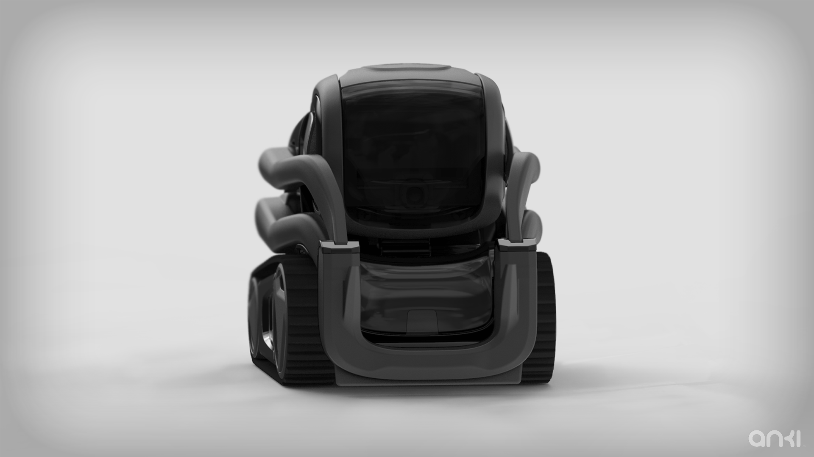
    * VIC-12697
	* 

* Tanagrams Face Puzzle
    * Trigger: Random. Voice Command. 
    * Description: Vector creates shapes and images using Tanagram shapes with this eyes. This is an opportunity to show growth from Bad Puzzling ---> Master Puzzling. This particular feature has a huge potential to show growth and thinking if we can control the stages and stagger them in a progressive way. Can have many levels/layers.
    * VIC-12673
    * Hanns Note: 
        1. Vector identifies a face.
        2. Decides he wants to show off with the Tangram animation.
        3. He drives toward the face and plays the Tangram animation.

* Freeze!
    * Trigger: Voice Command.
    * Description: Character moment for whenever you want Vector to freeze. 
    * Not Ready For Layout
* Vector Calibrating Body
    * Trigger: 
    * Description: 
    * Concept: Dei Gaztelumendi (Unlicensed)
* Eye Color Calibration
    * Trigger: 
    * Description: 
    * Concept: Dei Gaztelumendi (Unlicensed)

## Style Guide (for on-screen visuals)

### Overview

Vector's One-Off's are opportunities for us to engage and entertain Users, while giving them a better understanding of Vector and his "inner world". Because he is a robot, it's imperative that we show how he thinks, sees, and dreams in order to reinforce his "aliveness" and build a stronger relationship between him and the User. By creating a unique retro art style, we can reflect his world, sensibilities, and construction, while maintain the illusion of 'self' and appealing to an adult target audience. 

Our style is inspired by Vector's rounded square eyes and pays tribute to the retro aesthetic of 80's pixelated game art (Mario, Donkey Kong, Space Invaders, etc.). The simplicity of this pixelated 80's style is not only  "techy" and appealing to our audience, but also readable at a small screen size. We use the "rounded square" as stylistic inspiration to remind users we are "looking into" Vector's thoughts - that in his world, everything is influenced through his rounded square eyes. Below is a mini mood board for inspiration.

(Inspiration)

(Inspiration)

#### What We Came Up With:

By combining the retro "atari" look and influence of the rounded square, we can solidify a consistent visual of Vector's world, thoughts, and dreams.
Here are enlarged examples what we came up with:

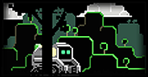

Canvas: 184x96

The actual canvas is not very large, being only 184x96. By keeping the style simple, outlined, blocky, and to 4-5 tones, we can keep images simple and uncluttered for clarity.

#### General Rules of Style:

* Always use a black vignette around the canvas to hide Vector's window borders, we want to avoid revealing borders as much as possible.
* We want to use foreground, middle, and background elements to indicate and push depth. Vector should be between foreground and middle elements.
* Keep to 4 distinct tones, but no darker than 65%, or it will get lost behind the faceplate.
* Use a 'brighter' palette to offset the darkness of Vector's actual faceplate. 
* Try to use Vector's rounded square eye shape for inspiration when designing characters and environment elements. This will maintain the illusion of Vector's "world" and how he sees/imagines things.
* Keep to simple shapes and outlines, like Atari's Space Invaders or 80's Mario.

Although both Character and Environments use similar aesthetics, each has different rules applied to their style.

## Characters
Characters should always be the focal point of the animation. They are after all, the CHARACTERS! To do this, we give the characters a brighter tone and the brightest highlights, almost like a rim light, on the screen to make them POP against the backgrounds. Keep the designs fun, rounded, simple, and to 4 tones.

#### General Rules to Character design:

* Designs should not be smaller than 18w x 18h pixels
* Keep designs softly squarish
* Color and Tones: ~4 Tones
    a) Highlights are White, to pop the character from the background
    b) Tones, on the brighter side, no darker than 60% in 'shadow' areas
* Outlines are not more than 2px wide
* Limbs and body parts should be separated on their own layers - please check with an Animator before designing parts
* Eyes need to be at least 3w x 3h pix to allow expressions. To round eyes, use a darker tone in the corners to give the illusion of receding, 'soft corners'. 

### Vector 
In this example, we will break down Vector's Character Design to describe the thought process and structure for future reference.

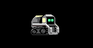
(Actual Size)

Size: 56w x 41h pixels
Eyes: 5w x 5h pixels

#### Tones

Vector uses 4 tones. Nothing darker than 65% to allow him to POP against the background. The Character's brightest highlights and rim light should always come from the RIGHT and be 100% WHITE to help pop the character off the backgrounds.

Tones are detailed below:

(Image above is larger to show example)

#### Eyes

Vector's eyes are 5w x 5h px. To "round" the eyes, we darken the corners to give the illusion of receding, 'soft corners'. 

#### Parts

Each part should be designed on its own layers and labeled, for ease of export. Before designing, check with an Animator to ask how a particular character should be separated. Depending on the Animators' needs, some parts might be more separated, like the Bug Character (below) whereas Vector has larger pieces because of his limitations in movement.

(Image above is larger to show example)

Vector parts are mostly divided by what needs to move. His body consists of his shell, treads, and wheels because the only parts moving in his body are the wheels - for simple A/B movements to show 'rolling'. His head, on the other hand, has more separated parts - each eye moves individually along with the a detached faceplate for up/down movements. We use bright white highlights to offset him from backgrounds.

#### Poses

(enlarged for example)

Vector's positions and turnarounds are very limited in order to mimic 80's animation style. We are not looking for a smooth rotation. Through mirroring and simple A-B poses, the Animator will be able to create a very simple, yet charming style of movement. His positions will be fixed in Side, Front, and Back views. Rotations can be mirrored using these assets. When creating new characters like this, we will want to consider similar limited positions for A-B type animations.

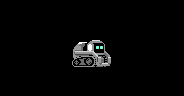

Animation GIF test of Vector's 'walk' cycle

#### Bug

(Actual Size)

Bug is 18w x 18h pixels

Eyes are at least 3w x 3h pixels

As you can see in the above Bug example (below left), his parts are broken out very specifically. The Animator will decide what to rig and parent, and for this example, it was decided to disconnect all the parts. The list (bottom, right), is a visual hierarchy of how the layers are listed in Photoshop, the top being the most in foreground to the bottom, the most back layers.

## Environments

The backgrounds play a very special part to describe and take us to Vector's world, dreamscapes, and thoughts. The designs should reflect the story of his imagination/dream and be influenced by his rounded square shapes. Remember that we're going for an 80's retro aesthetic. They should be simple, yet show complexity and clarity in design, shape, and composition. They should also blend seamlessly with Vector's window, staying black. We should  always try to AVOID showing the edges of his window. 

Here's an example of an environment below:

(Not actual size)

The design of the environments is simple, outlined, shaped, and multi-layered. These are much more technical to tackle in the beginning, but with the right process, be easier to export and modify for future uses. 

#### General Rules of style:

* ALWAYS HIDE THE BORDERS OF VECTOR'S WINDOW. Use the black vignette provided to hide the canvas. Background skies and negative space are always black, to hide window borders
* Keep shapes inspired by Vector's rounded square eyes
* Use 4 Levels in Environments: 
* Foreground - Elements IN FRONT OF EVERYTHING (grass, rocks, trees, etc.) are always BLACK to hide borders and create continuity with black backgroud
* Middleground - 2 levels of elements that use black fill and colored outlines
* Background - Elements use muted solid fill, no outline
* Extras - Elements that float behind the Background
* For brighter elements like the sun, moon, clouds - always use behind or in front of Background to help silhouette and define the environment.
* Outlines should not be more than 2px, add form when needed, but only slightly. 

(Actual size)

As you can see in the above images, the Characters pop very nicely from the background because they are brighter and more colorful. By keeping the environments 'dark' with black fills and hints of color in the outlines and backgrounds, we can have very complex looking backdrops while keeping the characters and environmental elements clear and distinct. Notice how we try to keep very obvious and iconic visuals to reflect the environment and narrative. 

Keep in mind also while designing day versus night scenes. Those will have different vibes, and we will use colors different ways to achieve the 'effect' of day and night. For example, a day city scene (below left) would have more muted tones to reflect the lack of brightness in the day in the windows/highlights. While a night time city scene (below right) might use yellow tones to describe 'night' windows and highlights. Foreground and background elements, like a sun or moon, can be helpful to enhance day/night visuals.

 
(enlarged for example)

#### Designing Environments 

While designing, lean towards similar styles above. Do not go realistic, keep things blocky and simple. Note how elements are inspired by Vector's rounded square eyes

#### Step-by-step Guide

The above is an example of how to set up an environment design. Although there are many elements, keeping your layers organized is very important, as it is easy to lose track of where you are.
Recommended steps are below, although alternate ways are always welcome:

1. Create solid fills for Middleground and Background. This stage is to get general shapes and composition, compose elements in interesting and dynamic ways. Colors of the fills WILL change, do not worry about them here. 
2. Make outlines to create a sense of overlap and depth of 2 levels. Outlines are colored to express the landscape and get increasingly darker behind the next. Outlines colors are never brighter than characters.
    Outline Tones: 1st level ~35%
    2nd level ~50%
3. Add HIGHLIGHTS to Middleground, only. Highlights should always be on right side, and just define a little more shape. Image should still be relatively flat. Outline colors are never bright than characters.
    Highlight tones:
    1st lvl - 20%
    2nd lvl - 35%
4. After creating shapes, outlines, and highlights, select layers to create SOLID FILL LAYERS to enable easy color picking. The colors should always be reflective of the environment and never brighter than Vector.
    Middleground - Change to BLACK
    Outlines - Remain the same. Make adjustments to tones/colors as needed.

    *To make Solid Fills - Select the desired shape > Go to the half-circle Adjustment layers icon at the bottom of Layers > Select "Solid colors". Although tedious, you will need to do this for all the solids and outlines to make it easier to change colors, should the need arise. This will ultimately make things easier for you and other designer, if we have to make changes or react to requests. 
 
    

    (Detail of how to make "Solid Fills") 

5.  Add EXTRA ELEMENTS as needed to enhance story.
    Extras IN FOREGROUND - Like Grass, rocks, fence, etc. can be in very front to immerse Vector into the environment. Tone 100% Black
    Extras BEHIND MID-LEVELS - LIGHT Elements like clouds, sun, moon, etc. in order to enhance 3rd lvl silhouettes. Never in front of Middleground. Tone: 10-20% 

## Legacy Research & Experiments

Concepts, research, and work that lead to our current style. 

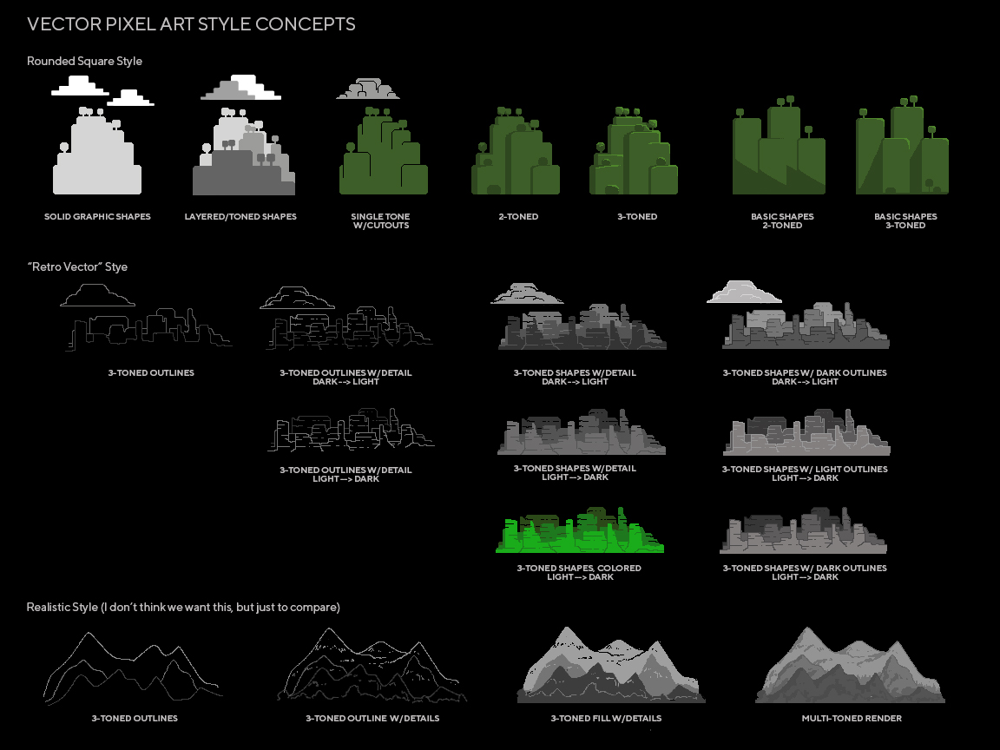

These experiments (above) were to test the boundaries of what kinds of styles could work for the One-Off's. As you can say, there are many iterations of outlines and solid fills. In the end, we decided to go with a combo of dark outlines and fill.

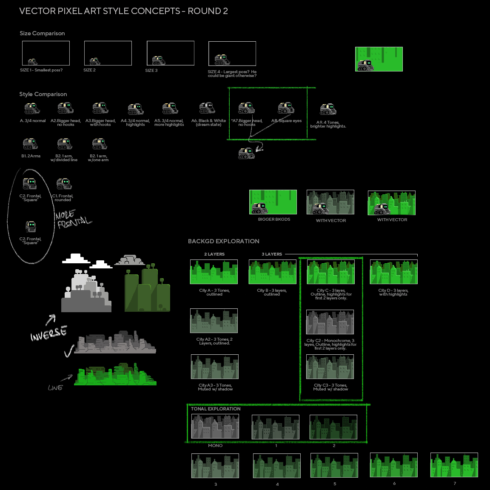

These tests (above) were to test Vector at various sizes within his canvas and also define his look. We also defined more environment design, indicated by the green highlights. At this point, we were planning use colored fills in the environments based off Vector's chosen eye color.

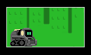

Animation GIF test of Vector flying through a larger Cityscape

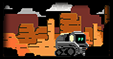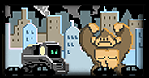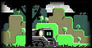

Our initial process of environments, converting them from "Imagination" mode in full color to "Dream" mode in monochrome. We liked the idea of full color environments, but decided that at such a small scale, it was going to look too busy. We wanted the characters to be easily distinguishable from the backgrounds and not get lost in the colors of the environment. There was also the issue of trying to hide Vector's window borders, to maintain the illusion that his whole faceplate is his face. But, because full color environments were pushing those limitations, we decided to drop it and use silhouetted, black, filled environments instead.
