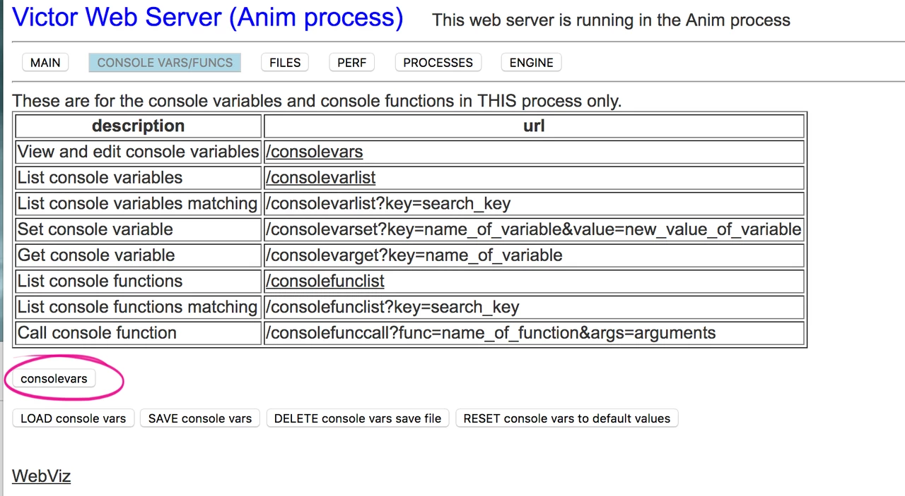
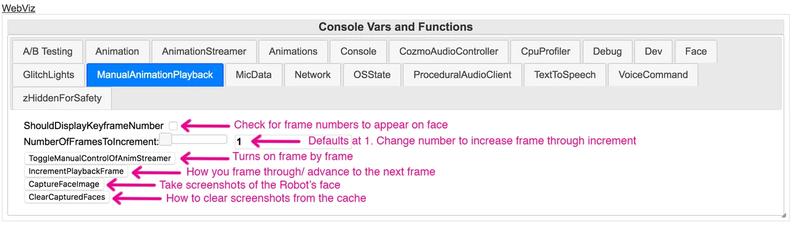

# Frame By Frame Playback On The Robot
Created by Leigh Ausiello Jun 14, 2018

### Frame By Frame Playback on the Robot and Image Capture

Note: This is most useful while using the layered png sequence method, but it can be used for any animation.

1. Make sure Victor is connected and ready to play animations in Maya
2. In Chrome, open the web console to the animation process page by typing robotIP:8889
    1. Victor must be connected and ready to play animations in order to access this page
3. Select *consolevars* 

4. Click on *ManualAnimation Playback* tab

5. Click *ToggleManualControlOfAnimationStreamer*
    1. This allows you to use the frame by frame feature (aka manual animation streamer).
    2. The procedural eyes should freeze. This indicates that the animation streamer is toggled ON.
6. In Maya, *Play Animations on the Robot* to enable clip for the animation streamer
    1. The streamer will not work without playing a clip
    2. When in control of the manual animation streamer, only the face track should play back. No head, lift or body animation should play.
7. Click *IncrementaPlaybackFrame* to frame through the face animation on Victor’s face
    1. The next frame of the animation should be displayed on Victor’s face.
    2. Click *IncrementaPlaybackFrame* again to advance to the next frame in the animation clip. Click as many times as needed.
    3. At this time, there is no way to frame backwards. Forwards, only!
    4. To restart the animation at 0, Play Animation on the Robot again.
8. Check *ShouldDisplayKeyframeNumber* box to display the current frame number to the top left of the robot's face
    1. This allows you to know exactly which frame of your png sequences needs adjusting
9. Frames can be incremented by any amount by changing the NumberOfFramesToIncrement from 1 to another number
    1. Example: to frame through every two frames, change the number to “2”, etc.
10. You can make a screen capture of any frame of the robot’s face
    1. Click *CaptureFaceImage*
    2. At the top of the page next to “console vars/funcs”, click on *FILES*
    3. Click on cache
    4. Click on *dev_face_imgs/*
    5. Download the linked image
    6. 

11. Delete the captured face images
    1. This should be done every time because captured images do not overwrite. If you make changes to the animation and try to image capture the same frame twice, the new frame will not replace the original captured image.
    2. Click *ClearCapturedFaces* button
    3. At the top of the page next to “console vars/funcs”, click on *FILES*
    4. Click on *cache*
    5. Click on *dev_face_imgs/*
    6. Refresh the page by typing command shift r
    7. The page should now say: _Error 404: Not Found Not found_ and the captured frames should be deleted
