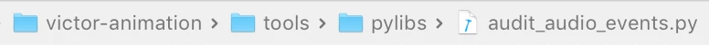
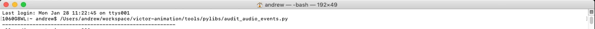

# How-to: Audit Audio Events.
Created by Andrew Bertolini Jan 28, 2019

## Summary: 
We have access to a script that can be used to audit all active audio events and the animations they are tied to. This script is useful for tracking down a handful of things:

1. Which animations are using a particular audio event.
2. The overall frequency that an audio event is used. 
4. All audio events that are actively being used. 

The script is called *audit_audio_events.py* and can be found in:



## Usage: 
To run this script do the following: 

1. Navigate to the pylibs folder seen above. 
2. Open terminal.
3. Run the script. 
    a. IE: /Users/andrew/workspace/victor-animation/tools/pylibs/audit_audio_events.py




## Formatting:
The script displays information in three separate formats:

1.  All Actively Used Audio Events. This looks like: 

```
	all audio events in use = 322
	'Play__Dev_Robot__Tone_10_Frames_01',
	'Play__Dev_Robot__Tone_150_Frames_01',
	'Play__Dev_Robot__Tone_30_Frames_01',
```

2.  Audio Events by Anim Clip(Which audio events a specific anim clip uses). This looks like:

```
	events by anim clip = 1161

	'anim_avs_error_getout_01': ['Stop__Robot_Vic_Sfx__How_Old_Loop_Stop',
								   'Play__Robot_Vic_Sfx__Scrn_Sad_Long',
								   'Play__Robot_Vic_Sfx__Head_Down_Short_Sad',
								   'Play__Robot_Vic_Sfx__Scrn_Curious'],
```

3. Anim Clips by Audio Events(Which anim clips a specific audio event can be found in). This looks like:

```
	anim clips by event = 322

	'Play__Robot_Vic_Sfx__Blackjack_Win': ['anim_blackjack_victorlose_01',
											  'anim_blackjack_victorbust_01',
											  'anim_blackjack_victorbjacklose_01'],
```
