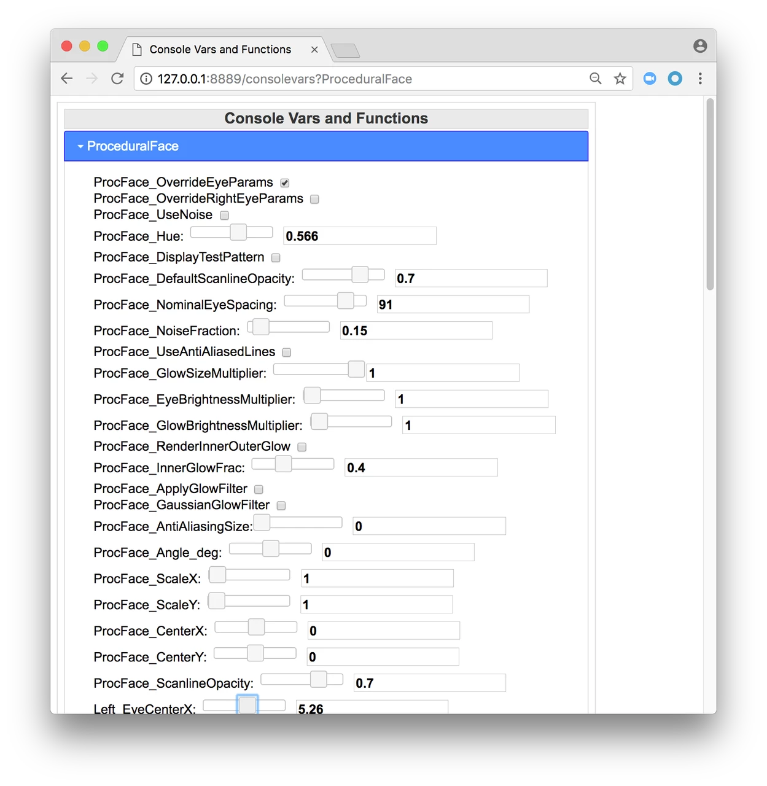

## ProceduralFace

A `ProceduralFace` is simply the container for all the parameters it takes to renders the robot's eyes.   Most of the parameters control the shape and position of each eye independently, including the height, width, corner curvatures, and upper and lower lid shape/position. There are also "whole face" parameters for rotating, scaling, and translating, the entire face or adjusting the contrast of the stylized "scanlines". 

The actual rendering is done by a separate class, the `ProceduralFaceDrawer`. At a high level, each eye's shape is drawn as a filled polygon whose points are rotated, shifted, and scaled into place. Then the eye lids are drawn on top to black out their shapes. The face is drawn in HSV (or HSL) space because the hue of the face is not animated but rather controlled as a global setting configurable by the user.

**TO DO:** Add a diagram explaining the parameters visually.

**TO DO:** Consider renaming to "ParameterizedFace" or something similar. "Procedural" implies the face is generated at runtime, based on our usage of the word elsewhere. In fact, a ProceduralFace is just a rig with a bunch of parameters and is also stored in "canned" animations.

## Console Variables

Console Variable (aka Console Var) is a setting that helps control something on the robot, eg. ProcFace_UseAntialiasing is the console variable that tells the engine whether it should use antialiasing when rendering face/eye images.

Most console variables have a default value, but we also expose ways for users to change these settings on the fly.

Here are some useful console vars that are relevant to the robot's face/eyes:

* enable Victor eye/face rendering by setting ProcFace_VictorRenderer to true
* set ProcFace_UseAntialiasing for antialiasing
* set ProcFace_RenderInnerOuterGlow and/or ProcFace_InnerGlowFrac for eye hotspots
* enable eye glows by setting ProcFace_ApplyGlowFilter to true (and then animators can turn that off via the corresponding rig attribute if/when needed)

Is there a console variable to control the overall hue of the face?

## Webservice

Navigate to http://192.168.40.29:8889/consolevars?ProceduralFace, using the IP address of your robot, to see:

* Click the VictorFaceRenderer button enable Victor eye/face rendering, CozmoFaceRenderer is legacy but also less performance heavy on real hardware.
* Click ProcFace_OverrideEyeParams to use values from the sliders to override the values of a playing animation, e.g. if checked the face will use the ProcFace_angle_deg from the webservice instead of the value in the current playing animation.
* Use ProcFace_Hue to change the overall hue of the face

